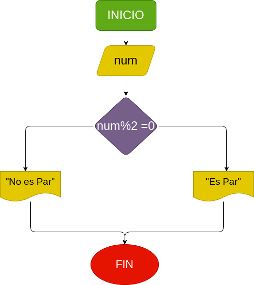

# Par_Impar
Construir un programa que lea un número entero y que determine si se trata de un número impar o par

## Input

- se detectara si el numero es par o impar,
si la divicion en ese numero entre 2 el residuo es igual a 1 es impar y si es 0 sera par

# Diseño
